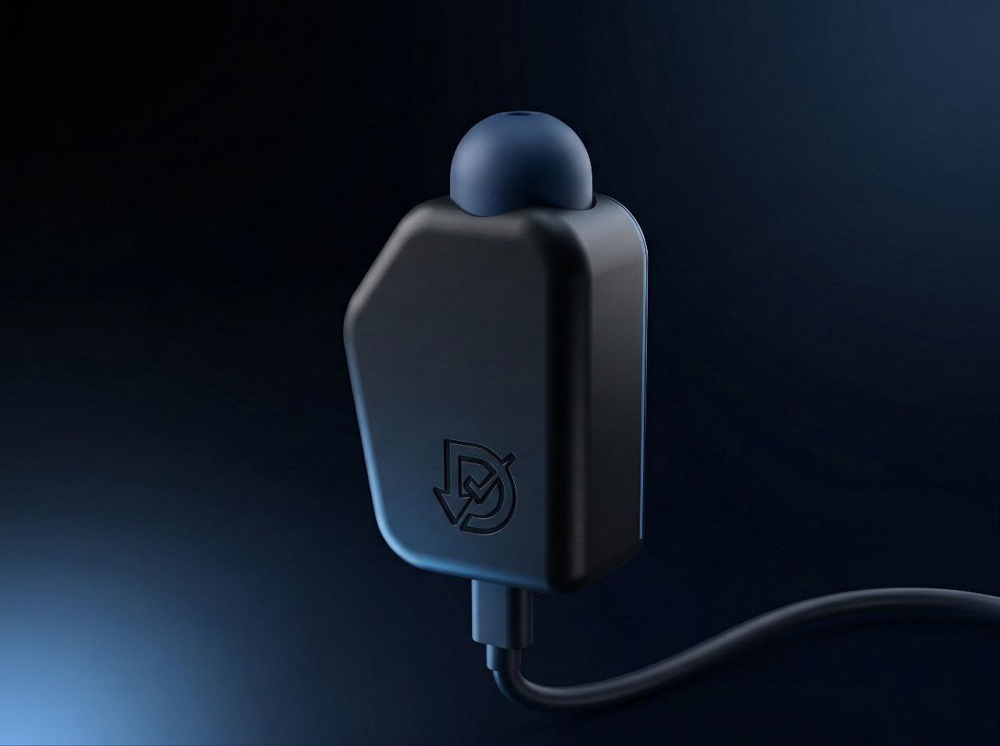

<div align="center">


### See your equalization.

<p>Real-time pressure visualization for freediving equalization training — 100Hz BMP280 sensor,<br>
USB MIDI zero latency, six-platform Flutter app, ECDSA-authenticated RP2350 firmware.<br>
Two products: <strong>DiveChecker</strong> (sensor) and <strong>DiveChecker Vent</strong> (dry-land Mouthfill trainer).</p>

<pre><code># Get the app
Android: https://play.google.com/store/apps/details?id=kr.createch.divechecker
iOS:     https://apps.apple.com/kr/app/divechecker/id6758508799
Desktop: https://github.com/kernalix7/DiveChecker/releases/latest

# Buy the device
https://smartstore.naver.com/createch/products/13224634919</code></pre>

<a href="website/assets/images/hero-product.jpg">
  
</a>

<sub>DiveChecker DC-EQ01 — measures nasal pressure at 100Hz, visualizes Frenzel/Valsalva/Mouthfill curves in real time.</sub>

[](#status)
[](https://github.com/kernalix7/DiveChecker/releases)

[](LICENSE)
[](https://flutter.dev)
[](https://dart.dev)
[](0_Pico2-Firmware/)
[](LICENSE)
[](https://github.com/kernalix7/DiveChecker/actions/workflows/build.yml)
[](https://divechecker.createch.kr)
[](https://github.com/kernalix7/DiveChecker/stargazers)
[](https://github.com/kernalix7/DiveChecker/releases)

###### Runs on

[](https://play.google.com/store/apps/details?id=kr.createch.divechecker)
[](https://apps.apple.com/kr/app/divechecker/id6758508799)
[](https://apps.apple.com/kr/app/divechecker/id6758508799)
[](https://github.com/kernalix7/DiveChecker/releases)
[](https://github.com/kernalix7/DiveChecker/releases)
[](https://divechecker.createch.kr)

<sub>**English** &nbsp;·&nbsp; [한국어](docs/README.ko.md) &nbsp;·&nbsp; [Site](https://divechecker.createch.kr) &nbsp;·&nbsp; [Vent (Mouthfill)](https://divechecker.createch.kr/vent.html) &nbsp;·&nbsp; [Features](#-features) &nbsp;·&nbsp; [Quick Start](#-quick-start) &nbsp;·&nbsp; [Architecture](#-architecture)</sub>

</div>

---

> ### Status
> DiveChecker DC-EQ01 (sensor) is **shipping** (App v8.6.0, Firmware v6.0.0, KC-certified). DiveChecker Vent (Mouthfill dry-land trainer) is **coming soon** — sign up at the [marketing site](https://divechecker.createch.kr/vent.html). Report issues at <https://github.com/kernalix7/DiveChecker/issues>.

---

## 🎯 Overview

DiveChecker is a professional monitoring system that helps freedivers effectively practice **equalization (ear pressure equalization)** training.

Using a pressure sensor connected to a mouthpiece, it precisely measures subtle pressure changes (300-1250 hPa sensor range) when blowing or sucking through the mouth with **100Hz internal sampling + configurable output rate (4-50Hz)**, and visualizes them in real-time graphs.

### Architecture (v8.0.0)

**Smart MCU + Intelligent App**

```
[BMP280] → 100Hz → [MCU] → USB MIDI → [Flutter App]
    │                   │                       │
        └── Raw sensor      └── IIR + Averaging    └── All logic:
            data               Firmware filtering      - Display
                               Output: 4-50Hz          - Analysis
                                                       - Storage
```

| Component | Role |
|-----------|------|
| **MCU** | Sensor reading + IIR/Averaging filter + Configurable output rate |
| **App** | Display, analysis, storage (flexible, OTA updatable) |

### Supported Hardware

| MCU | Sensor | Status |
|-----|--------|--------|
| **Pico RP2350** | BMP280 | ✅ Fully supported |

### Why DiveChecker?

| Problem | DiveChecker Solution |
|---------|---------------------|
| Cannot verify if equalization is correct | Instant feedback with real-time pressure graphs |
| Difficult to measure training effectiveness | Objective evaluation with session recording + peak analysis |
| Difficult to practice consistent technique | Advanced analysis with rhythm score, fatigue index, etc. |

---

## ✨ Features

### 📊 Real-time Pressure Monitoring

<table>
<tr>
<td width="50%">

**Sensor Specs**
- **Sampling**: 100Hz internal → 4-50Hz output (configurable)
- **Firmware Filtering**: IIR x2 + Averaging
- **Latency**: ~10ms (sensor to app)
- **Sensor Range**: 300-1250 hPa (BMP280 extended)
- **Resolution**: 0.001 hPa (0.0016 hPa sensor resolution)

</td>
<td width="50%">

**Visualization**
- Real-time line chart (fl_chart)
- Pinch zoom / drag pan gestures
- 30-second sliding window
- Dynamic Y-axis auto-scaling
- Curved chart with smooth bezier
- Max/Avg pressure real-time display

</td>
</tr>
</table>

### 🔬 Advanced Peak Analysis

Detailed equalization quality analysis after measurement:

| Metric | Description |
|--------|-------------|
| **Rhythm Score** | Peak interval consistency (CV-based) |
| **Pressure Score** | Peak intensity uniformity |
| **Technique Score** | Rise/fall time, peak width analysis |
| **Fatigue Index** | Pressure decrease trend during session |
| **Overall Grade** | S~F grade overall evaluation |

**Peak Classification**: Weak / Moderate / Strong intensity classification

### 💾 Data Management

- **SQLite / IndexedDB**: Platform-specific auto-selection (Native/Web)
- **Session Recording**: Date, time, max/avg pressure, sample rate, notes
- **Graph Notes**: Add notes at specific points (numbered markers)
- **Backup/Restore**: JSON-based data export/import
- **Cursor Indicator**: Touch position with time/pressure display

### 🌐 Multi-language Support

- 🇺🇸 English
- 🇰🇷 Korean (한국어)
- 🇯🇵 Japanese (日本語)
- 🇨🇳 Simplified Chinese (简体中文)
- 🇹🇼 Traditional Chinese (繁體中文)

### ⚙️ Calibration & Configuration

- **Atmospheric Calibration**: 3-second sample collection then baseline setting
- **Output Rate Control**: 4-50Hz via F command
- **Oversampling Adjustment**: 1x ~ 16x (MCU command)

---

## 🔐 Security & Reliability

### Device Authentication (ECDSA P-256)

| Feature | Description |
|---------|-------------|
| **Challenge-Response** | 32-byte random nonce + ECDSA signature verification |
| **Private Key Storage** | OTP (One-Time Programmable) memory — non-extractable |
| **Constant-Time Comparison** | Timing attack prevention |
| **Memory Zeroing** | `mbedtls_platform_zeroize()` after crypto operations |

### PIN Protection

| Feature | Description |
|---------|-------------|
| **Rate Limiting** | Exponential backoff (1s → 2s → ... → 60s max) |
| **Persistent Lockout** | PIN failure count survives reboot (Flash stored) |
| **Constant-Time PIN Verify** | No timing side-channel |

### Data Integrity

| Feature | Description |
|---------|-------------|
| **Flash CRC32** | Settings integrity check on load |
| **Legacy Migration** | Old settings (no CRC) auto-upgraded on save |
| **Wear Leveling** | 16-slot rotation in 4KB sector |
| **3s Write Debounce** | Prevents flash wear from rapid slider changes |

### Self-Recovery Mechanisms

| Mechanism | Trigger | Recovery Action |
|-----------|---------|-----------------|
| **Watchdog** | 8s boot / 2s operational | Auto reboot |
| **Sensor Auto-Retry** | I2C failure | 5-second periodic retry (Core 1) |
| **App Auto-Reconnect** | USB disconnect | Exponential backoff (2/4/6s, 3 attempts) |
| **SysEx Parser Timeout** | Incomplete message | 500ms → reset to IDLE |
| **PIO Fallback** | PIO0 unavailable | Automatically use PIO1 |
| **Over-range Recovery** | Sensor saturation | Discard 30 samples after reset |

### Stability Features

| Feature | Description |
|---------|-------------|
| **Dual-Core Isolation** | Core 0: USB/MIDI, Core 1: Sensor (100Hz) |
| **I2C Mutex Protection** | Cross-core access serialization |
| **FIFO Communication** | Lock-free inter-core message passing |
| **Saturating Counters** | Diagnostics counters never overflow |
| **Atomic Config Updates** | Output rate changes via volatile + barrier |

---

## 📱 Screens

| Screen | Description |
|--------|-------------|
| 🏠 **Home** | Device connection, real-time pressure display, calibration |
|| 📺 **Monitor** | Real-time streaming chart with dynamic Y-axis |
|| 📈 **Measurement** | Live graph, Start/Stop/Pause, session recording |
| 📋 **History** | Session list → Graph detail → Peak analysis |
| ⚙️ **Settings** | Language, backup/restore, device settings, firmware update |

---

## 🚀 Quick Start

### Prerequisites

| Component | Version | Notes |
|-----------|---------|-------|
| Flutter SDK | 3.10.4+ | `flutter --version` |
| Pico SDK | Latest | For RP2350 firmware |
| USB Cable | - | Data transfer capable cable |

### 1. Install and Run App

```bash
git clone https://github.com/kernalix7/divechecker.git
cd divechecker/_0_DiveChecker-APP

flutter pub get
flutter gen-l10n
flutter run -d linux    # or android, windows, macos
```

### 2. Upload Firmware

```bash
# Build with Pico SDK
cd 0_Pico2-Firmware/Divechecker
mkdir build && cd build
cmake .. && make
# Copy .uf2 to Pico in BOOTSEL mode
```

### 3. Connect and Measure

1. Connect MCU to PC/Android via USB
2. App Home → **CONNECT DEVICE**
3. Select device → Connection complete
4. **Calibrate** (sensor stabilization)
5. Measurement tab → **START**

---

## 🏗️ Architecture

```
00_Divechecker/
│
├── 📱 _0_DiveChecker-APP/          # Flutter cross-platform app
│   ├── lib/
│   │   ├── main.dart               # App entry point
│   │   ├── constants/              # Theme, colors, app config
│   │   ├── core/                   # DB interface
│   │   ├── l10n/                   # Localization (EN/KO/JA/ZH/ZH_TW)
│   │   ├── models/                 # PressureData, GraphNote
│   │   ├── providers/              # State management (Provider)
│   │   │   ├── midi_provider.dart        # USB MIDI connection
│   │   │   ├── measurement_controller.dart # Measurement logic
│   │   │   └── session_repository.dart   # Session cache
│   │   ├── screens/
│   │   │   ├── home_screen.dart            # Connection & status
│   │   │   ├── monitor_screen.dart         # Real-time streaming
│   │   │   ├── measurement_screen.dart     # Real-time measurement
│   │   │   ├── history_screen.dart         # Session list
│   │   │   ├── graph_detail_page.dart      # Detailed graph + cursor
│   │   │   ├── peak_analysis_page.dart     # Peak analysis
│   │   │   ├── device_selection_screen.dart # Device selection
│   │   │   ├── device_settings_screen.dart # Device config
│   │   │   └── firmware_update_screen.dart # OTA update
│   │   ├── services/
│   │   │   ├── unified_database_service.dart  # DB integration
│   │   │   └── backup_service.dart            # Backup/restore
│   │   ├── security/
│   │   │   └── device_authenticator.dart      # ECDSA authentication
│   │   ├── utils/
│   │   │   └── peak_analyzer.dart        # Peak analysis algorithms
│   │   └── widgets/                # UI components
│   └── pubspec.yaml
│
├── 🔧 0_Pico2-Firmware/            # Pico RP2350 project
│   └── Divechecker/
│       ├── Divechecker.c           # Main firmware (dual-core, ~1800 lines)
│       ├── midi_sysex.c/h          # USB MIDI SysEx protocol
│       ├── usb_descriptors.c       # TinyUSB device descriptors
│       ├── ws2812.pio              # WS2812 LED PIO program
│       └── CMakeLists.txt          # Build config (Pico SDK 2.2.0)
│
├── 📐 0_CAD/                       # Hardware design (FreeCAD)
│
└── 📜 LICENSE                      # Apache 2.0 + CERN-OHL-S v2
```

### Communication Protocol (USB MIDI SysEx)

SysEx format: `F0 7D 01 [cmd] [data...] F7`
- Manufacturer ID: `0x7D` (educational/development)
- Device ID: `0x01` (DiveChecker)

**Device → App**

| Command | Hex | Description |
|---------|-----|-------------|
| Pressure | 0x01 | Delta pressure (7-bit encoded int32, hPa×1000) |
| Device Info | 0x02 | Serial, name, FW version, sensor status |
| Config | 0x03 | Output rate response |
| Auth Response | 0x04 | ECDSA signature (nibble-encoded) |
| Over-range Alert | 0x06 | Sensor exceeded measurement range |
| Temperature | 0x07 | BMP280 temperature (int16×100) |
| Diagnostics | 0x08 | Uptime, error counts, I2C recovery |
| Full Config | 0x09 | All configurable parameters |
| ACK | 0x0A | Command acknowledgment (cmd + status) |
| Ping | 0x10 | Keepalive request |
| Pong | 0x11 | Keepalive response |

**App → Device**

| Command | Hex | Description |
|---------|-----|-------------|
| Ping | 0x10 | Connection keepalive |
| Request Info | 0x20 | Request device info |
| Set Name | 0x21 | Set device name (PIN required) |
| Set Output Rate | 0x22 | Set output rate (4-50 Hz) |
| Reset Baseline | 0x23 | Reset pressure baseline |
| Get Config | 0x24 | Request full config dump |
| Set LED | 0x25 | Set LED brightness (0-100) |
| Reset Sensor | 0x26 | Manual sensor re-init |
| Factory Reset | 0x27 | Factory reset (PIN required) |
| Set Noise Floor | 0x28 | Set noise threshold (0-50) |
| Get Temperature | 0x29 | Request temperature |
| Enter Bootloader | 0x2A | Enter BOOTSEL mode (PIN required) |
| Get Diagnostics | 0x2B | Request runtime diagnostics |
| Set Oversampling | 0x2C | Set pressure oversampling (0-5) |
| Set IIR Filter | 0x2D | Set IIR filter coefficient (0-4) |
| Soft Reboot | 0x2E | Soft reboot (PIN required) |
| Auth Challenge | 0x30 | ECDSA auth (32-byte nonce) |
| Set PIN | 0x31 | Change PIN (old PIN + new PIN) |

---

## 🔧 Hardware

### Supported MCU

| MCU | Sensor | Status | Notes |
|-----|--------|--------|-------|
| **Pico RP2350** | BMP280 | ✅ Supported | Dual-core, USB MIDI, ECDSA auth |

### Circuit Configuration

**Pico RP2350 + BMP280:**
```
Pico RP2350         BMP280 (I2C)
────────────        ────────────
3.3V         ────── VCC
GND          ────── GND
GP8 (SDA)    ────── SDA
GP9 (SCL)    ────── SCL
GP16         ────── WS2812 LED
```

### Sensor Requirements

- **Pressure Sensor**: BMP280
- **Sensitivity**: ±0.01 hPa or better recommended
- **Mouthpiece Connection**: Connect to sensor via tube

> 📌 See [0_Pico2-Firmware/Divechecker/README.md](0_Pico2-Firmware/Divechecker/README.md) for detailed setup

---

## 🔮 Roadmap

### ✅ v1.0.0 Completed
- [x] 🎯 **Real-time pressure monitoring** - 100Hz internal + configurable output
- [x] 📊 **Peak analysis** - Rhythm, pressure, technique scores
- [x] 💾 **Session management** - Record, review, notes
- [x] 🌐 **Multi-language** - English, Korean, Japanese, Chinese (Simplified/Traditional)
- [x] 🔧 **Device settings** - Output rate, oversampling control
- [x] 🔄 **Firmware update** - OTA update support
- [x] 🔐 **Authentication** - ECDSA device authentication

### 🔜 Next Goals
- [ ] ⏸️ **Monitor pause & range save** - Pause monitoring and save specific ranges
- [ ] 🫁 **Lung capacity measurement** - Max inhale/exhale volume check
- [ ] 🧘 **CO₂ table trainer** - Carbon dioxide tolerance training
- [ ] 💨 **O₂ table trainer** - Hypoxia adaptation training
- [ ] 📤 **CSV export** - External analysis tool integration
- [ ] 🌐 **Cloud sync** - Firebase-based backup
- [ ] 🎯 **Training programs** - Guided sessions (8-week course, etc.)

---

## 🤝 Contributing

Contributions are welcome!

```bash
# After forking
git clone https://github.com/YOUR_USERNAME/divechecker.git
cd divechecker/_0_DiveChecker-APP
flutter pub get
flutter run
```

See [CONTRIBUTING.md](CONTRIBUTING.md) for details.

---

## 📄 License

This project is dual-licensed:

| Component | License | Scope |
|-----------|---------|-------|
| **Software** | [Apache License 2.0](https://www.apache.org/licenses/LICENSE-2.0) | App, firmware code |
| **Hardware** | [CERN-OHL-S v2](https://ohwr.org/cern_ohl_s_v2.txt) | Circuits, CAD designs |

See the [LICENSE](LICENSE) file for details.

---

## ⭐ Star History

<a href="https://star-history.com/#kernalix7/DiveChecker&Date">
  <picture>
    <source media="(prefers-color-scheme: dark)" srcset="https://api.star-history.com/svg?repos=kernalix7/DiveChecker&type=Date&theme=dark" />
    <source media="(prefers-color-scheme: light)" srcset="https://api.star-history.com/svg?repos=kernalix7/DiveChecker&type=Date" />
    
  </picture>
</a>

## 📊 Contributors & Activity

[](https://github.com/kernalix7/DiveChecker/graphs/contributors)

[](https://github.com/kernalix7/DiveChecker/pulse)
[](https://github.com/kernalix7/DiveChecker/commits/main)
[](https://github.com/kernalix7/DiveChecker/issues)
[](https://github.com/kernalix7/DiveChecker/pulls)
[](https://github.com/kernalix7/DiveChecker)

## 💖 Sponsor

DiveChecker is built and maintained by [@kernalix7](https://github.com/kernalix7) as a one-person hardware+app+firmware+site stack. If it helps your training (or your dive shop, your students, your PB), a tip keeps the lights on for the next firmware build, the next translation pass, the next CAD revision.

[](https://ko-fi.com/kernalix7)
[](https://fairy.hada.io/@kernalix7)
[](https://github.com/sponsors/kernalix7)

Ko-fi handles international cards and PayPal; fairy.hada.io is a Korean tipping platform; the GitHub Sponsor button (repo header) wires both. Bug reports, PRs, and stars on the repo are equally appreciated and free.

See [`.github/FUNDING.yml`](.github/FUNDING.yml) for the configuration.

---

<div align="center">

**Made with ❤️ for the Freediving Community**

[⬆ Back to Top](#-divechecker)

</div>